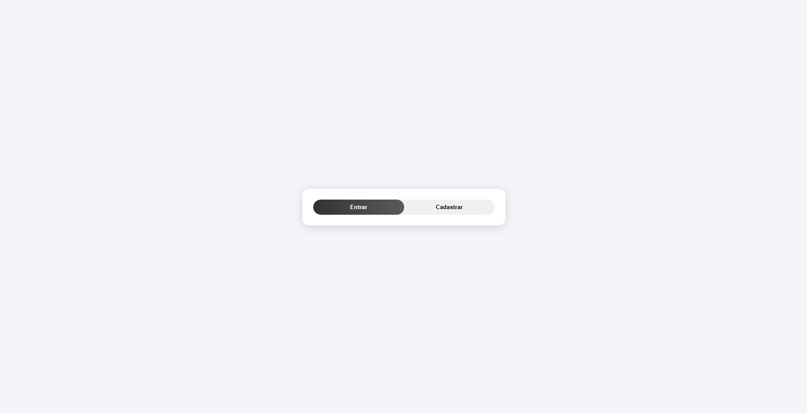
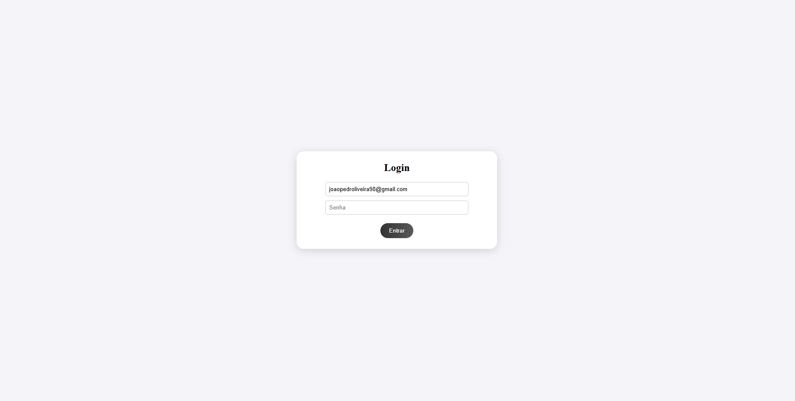
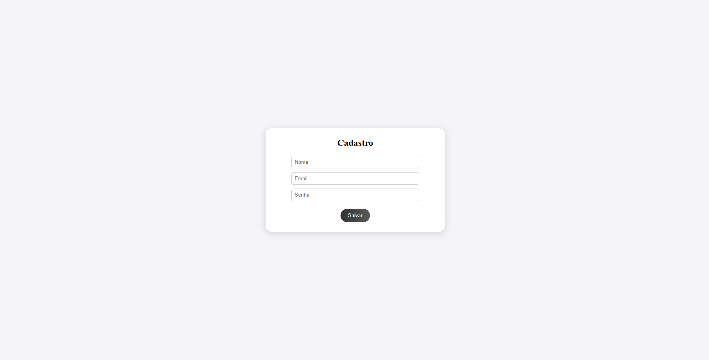
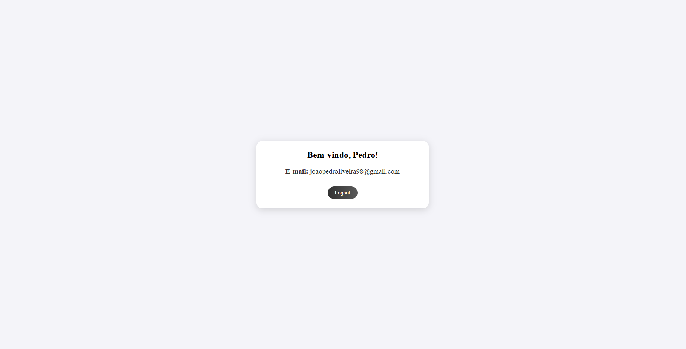
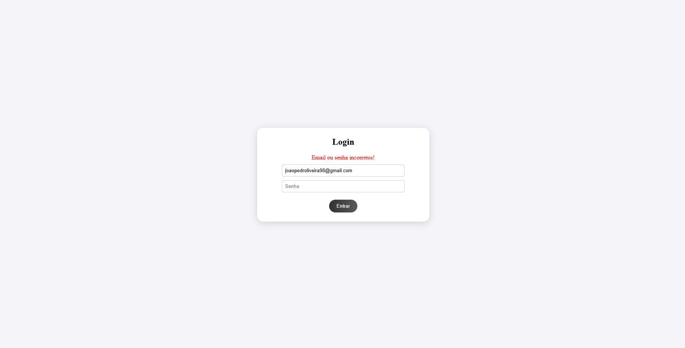

# Sistema de Login e Cadastro em PHP

Este projeto é um sistema simples de login e cadastro feito em **PHP**, com **HTML e CSS**.

---

## Funcionalidades

- Página Inicial: Permite escolher entre ir para a tela de Cadastro ou Login. Após o logout, o usuário é redirecionado de volta para esta página.

- Cadastro de usuário: Permite criar uma conta informando nome, e-mail e senha. Os dados são salvos em um arquivo de texto e um cookie armazena o e-mail para preenchimento automático na tela de login.

- Login: Verifica e autentica o usuário com base nas informações cadastradas. Ao entrar com sucesso, uma sessão é criada.

- Área do Usuário: Exibe nome e e-mail do usuário logado. Inclui um botão de Logout que encerra a sessão e redireciona para a Página Inicial.
---

## Pré-visualização

  
  
  

  
  
  

  
  

---

## Tecnologias Usadas

- PHP  
- HTML5  
- CSS3

---

